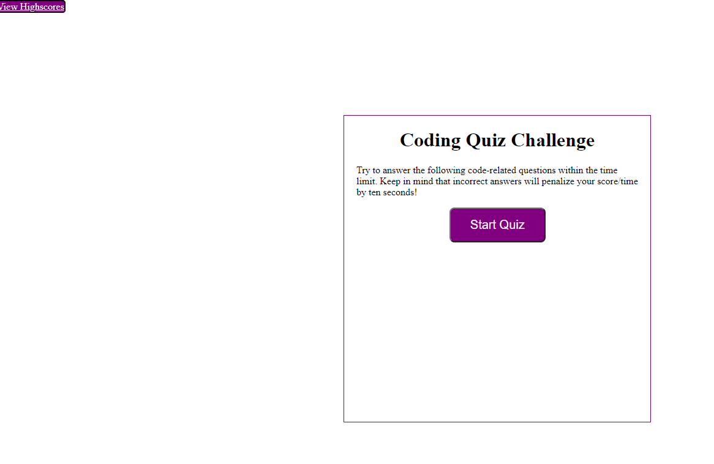
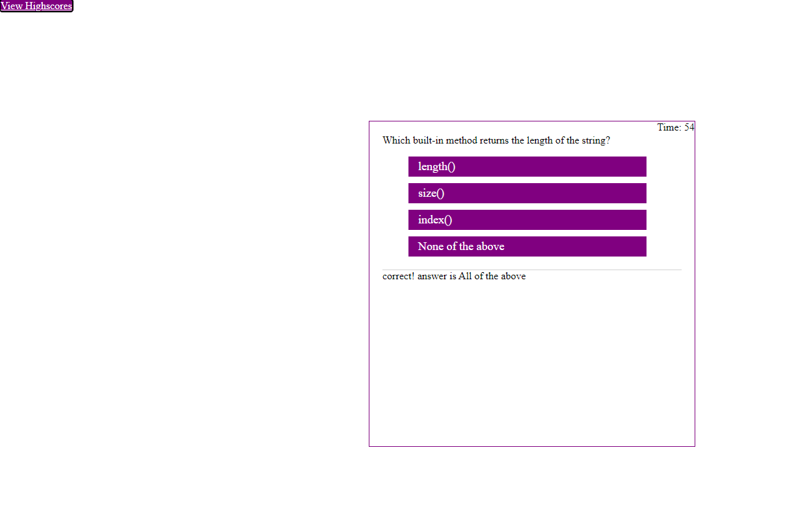
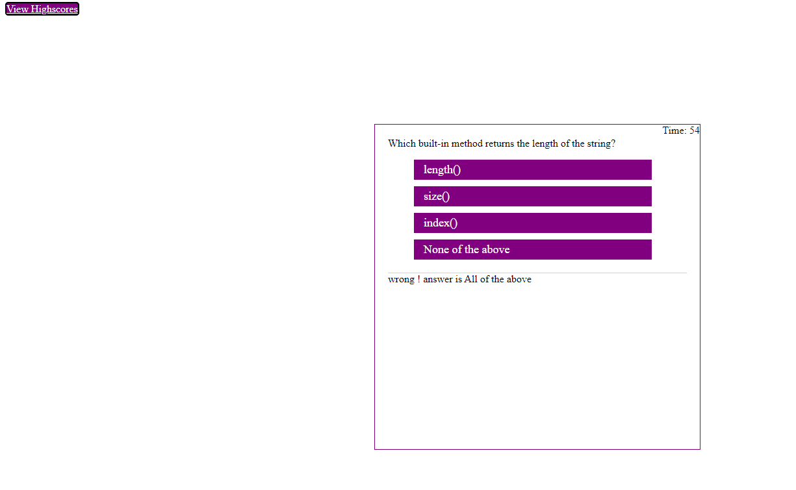
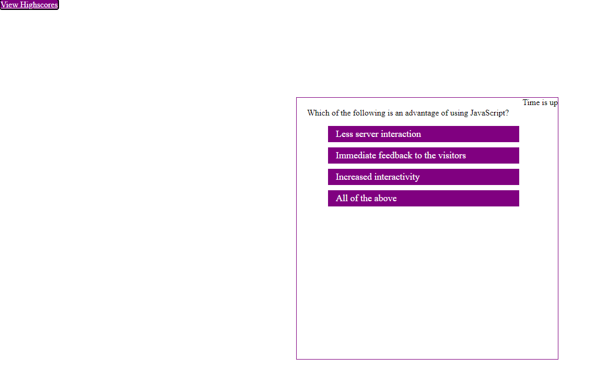
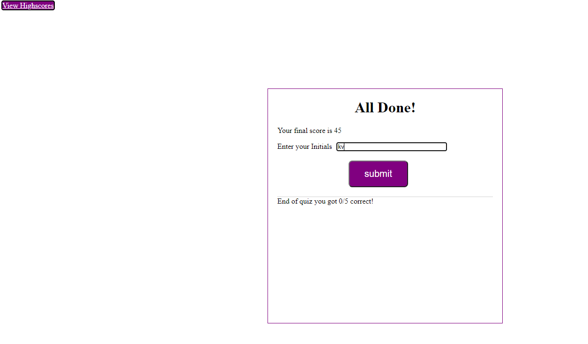
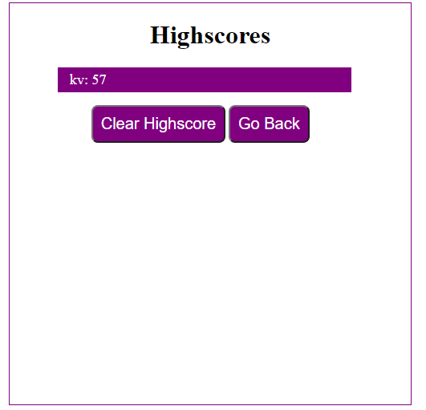
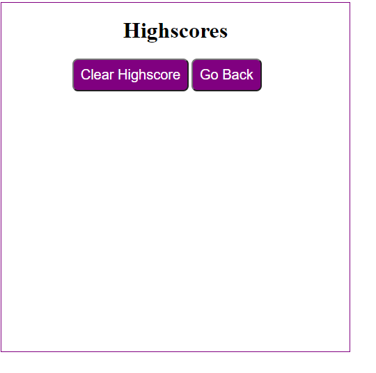

# Home-work-Assignment
##  Javscript-code-quiz
### App Decription
For this homework Assignment created a quiz app using html,css and Javscript.
Used webApis and Dom manipulation for creating the html elemnts dynamically during the 
runtime of the application.Used css for styling and written media queries to make the 
app look good on various widthports.

### App functionality
This app opens up with the start quiz page,
Once the user clicks the start quiz app button, the quiz starts with a series of questions with multiple
choices, and the timer starts with 75 seconds.If the user click the correct answer choice the score increases with 1 point and for every wrong answer the time left gets reduced by 5 seconds as a penalty. If the user cannot complete the quiz within the time left, the quiz ends and timeup screen showsup. The score depends on how fast the user finishes the quiz.The overal score sums up the score with the timeleft.Then the user can submit the initials and it takes to the highscore page.Here we can find the history of quiz taken with the initials submitted.

## Mockup
The following images show the overall functionality of the application

The following image shows the questions and anwers page with correct answer

The following image shows the questions and anwers page with correct answer

The followong image shows the timeup page if the user's given time get's expired

The following image shows the score-Page

This page shows the highscore with the initials, if it's taken more than once it shows the history,
if it's taken for the first time it shows the list with initials and score.There are 2 buttons clear and goback,
clear button clears the localstorage and the goback button takes back to the start quiz page.

Once clearbutton is clicked the previous history is lost and the page looks like this

## Github page of this Application
[javascript-code-quiz](https://selvivini.github.io/code-quiz-app/)
